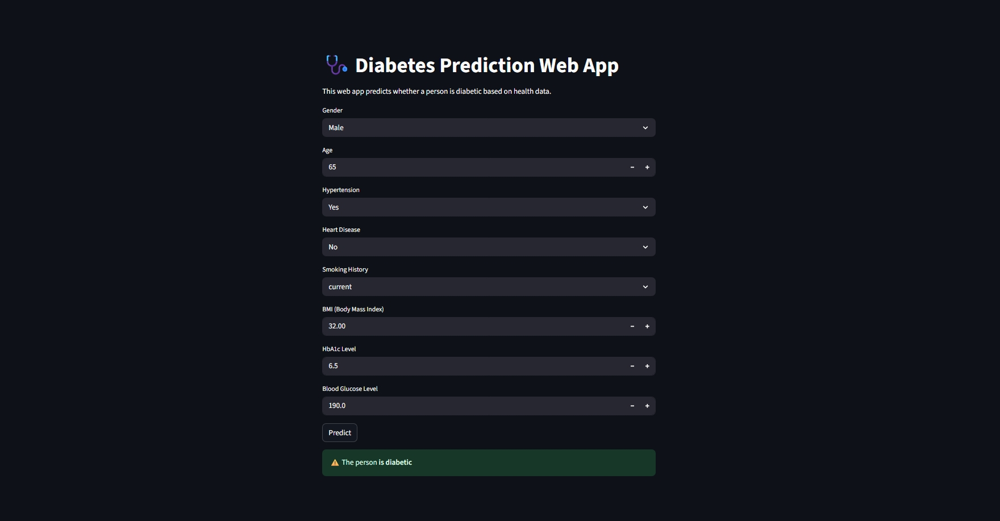

## 🩺 Diabetes Prediction using Machine Learning and Streamlit

This project predicts whether a person is likely to have diabetes based on medical and lifestyle features using a trained machine learning model. It includes a clean and interactive web application built with **Streamlit** for easy user input and real-time predictions.

---

### 🚀 Features

* 💡 Predicts diabetes presence based on health parameters like age, gender, BMI, HbA1c level, blood glucose, hypertension, heart disease, and smoking history
* 📊 Uses machine learning classification (e.g., SVM or your preferred model)
* 🧪 Trained on a real-world diabetes dataset including lifestyle and medical factors
* 🖥️ Interactive web UI using Streamlit
* 📁 Model serialized using `joblib`
* 🧠 Easy to use – just input values and get results instantly

---

### 🛠️ Technologies Used

* Python
* Pandas, NumPy, Scikit-learn
* Streamlit
* Joblib (for model saving and loading)

---

### 📂 Folder Structure

```
├── diabetes_prediction_streamlit/
│   ├── app.py              # Streamlit app file
│   ├── model.pkl           # Trained ML model
│   ├── diabetes.csv        # Dataset (optional)
│   └── requirements.txt    # Dependencies
```

---

### ⚙️ How to Run

```bash
# Install dependencies
pip install -r requirements.txt

# Launch Streamlit app
streamlit run app.py
```

---

### 📷 Preview



---

### 📚 Dataset Details

Your dataset contains features such as:

* Gender (Male/Female)
* Age
* Hypertension (Yes/No)
* Heart Disease (Yes/No)
* Smoking History (never, No Info, current, former, ever, not current)
* BMI (Body Mass Index)
* HbA1c Level
* Blood Glucose Level
* Diabetes (target variable)

---

### 📌 Note

This app is for **educational and demonstration purposes only** and should not be used for medical diagnosis or treatment.

---
